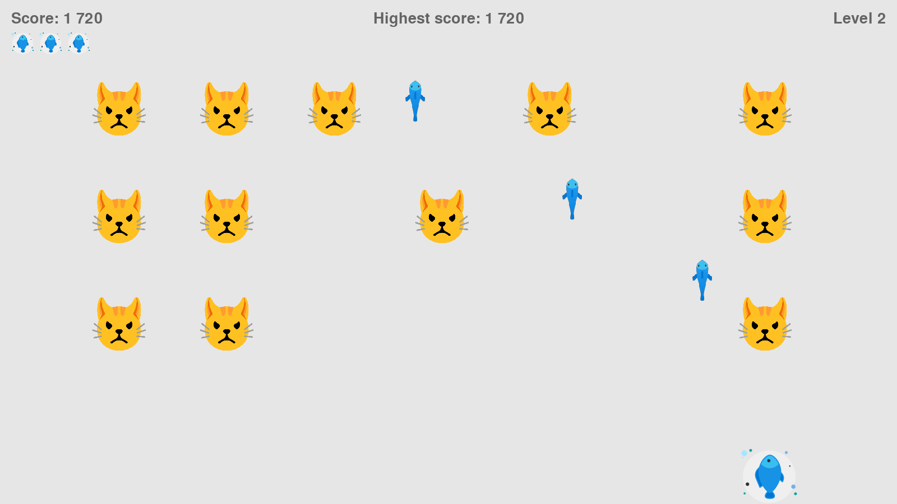

<div align=center margin= auto> 
  
</div>

# 😺 Kittens Invasion
Kittens Invasion is a clone of the popular arcade game Alien Invasion.
I created this game by following the "Python Crash Course" book. The reason was to improve my python skills.

## 🚀 Introduction
> In Kittens Invasion, the player controls a plate with fish that
appears at the bottom centre of the screen. The player can move
the plate to the right and left using the arrow keys and shoot fish
using the spacebar. When the game begins, a squad of kittens appears
and moves across and down the screen. The player throws fish and
feeds the kittens. If the player feeds all the kittens, a new squad
will appear and move faster than the previous one. If any kitten hits
the player’s plate or reaches the bottom of the screen, the player
loses a plate. If the player loses three plates, the game ends.

## 🔧 Requeriments
- [Python](https://www.python.org/) 3.x +
- [Pygame](https://www.pygame.org/)

## 🎮 Controls

- Spacebar
  - Throw a fish

- Arrows keys (left / right)
  - Move the plate left / right

## ⚔ Let's play

### Cloning the Repository

```
$ git clone https://github.com/bryanlds/Alien-Invasion.git

$ cd Alien-Invasion
```

### Running 

```
$ python alien_invasion.py
``` 

Enjoy!
