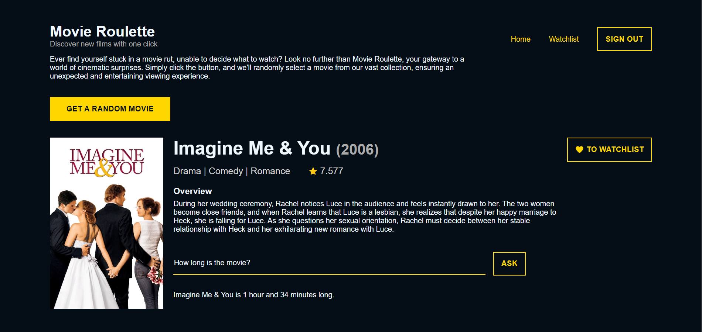
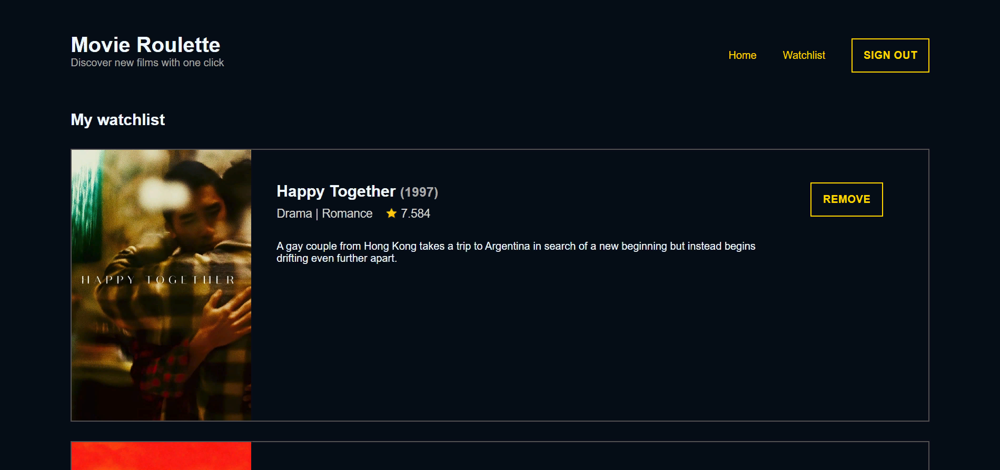

# 🎬 Movie Roulette — AWS Serverless Web App
Movie Roulette is a serverless movie recommendation web application.
The app uses AWS Amplify for the front-end, AWS Lambda for serverless
backend functions, and AWS DynamoDB for storage. Users interact with
the app through a web interface, which is built using HTML, CSS, and JavaScript.

Please, follow the link to see the app up and running:
<a href="https://dev.d2gx1wn92mmx93.amplifyapp.com/index.html">https://dev.d2gx1wn92mmx93.amplifyapp.com/index.html</a>.
In case the app doesn't work as you expect, please refresh the page,
it'll fix itself ✨

## Here’s how the app works

 
  

1. User interacts with the app through a web interface. They can push
the "Get a random movie" button, which will fetch a random movie
from a collection of 2000 most popular movies ranked by TMDB and stored
in their databases. Alternatively, they can sign up / sign in and
compile/see their watchlist.

 
  

2. The request is routed to the appropriate API Gateway endpoint and to
   an AWS Lambda function.

3. Lambda function gets triggered and processes the request.There are five functions:
> * getRandomMovie: retrieves a random movie from TMDB,
> * saveToWatchlist: saves a movie to the user's watchlist,
> * getWatchlist: retrieves the user's watchlist,
> * removeFromWatchlist: removes a movie from the user's watchlist,
> * getAIAnswer: answers any user's question about the given movie with the help of Gemini.

4. The Lambda functions interact with a DynamoDB table to store and retrieve
   movie data and user watchlist data.

 
  

5. The API Gateway sends the response from the Lambda function back to
   the user's browser and the user enjoys the experience.

Enjoy!
